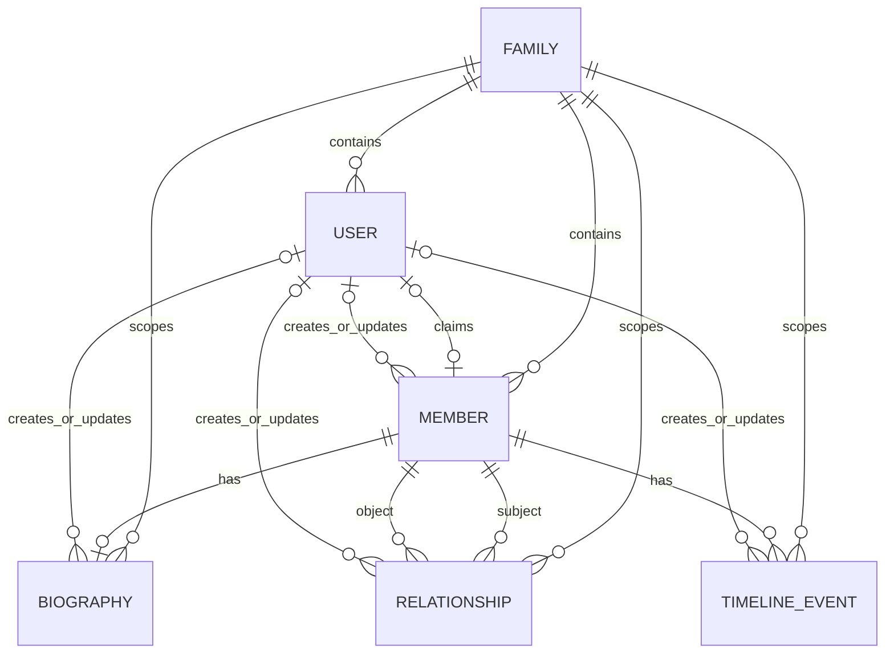

# RootLink Database

This document defines the V1 PostgreSQL data model, Prisma schema, migration rules, seed strategy, permissions/provenance fields, and backup/restore baseline.

## Entity relationship diagram



The design below uses physical snake_case tables with Prisma @map / @@map so that the SQL layer stays easy to inspect while the application layer retains idiomatic PascalCase models and camelCase fields. UUID primary keys are stored as PostgreSQL uuid via @db.Uuid, short bounded fields use @db.VarChar(n), free-form narrative fields use TEXT, created_at uses @default(now()), and updated_at uses Prisma’s @updatedAt. Prisma documents that String maps to provider-specific database types by default, but native database types can be specified explicitly; it also documents both uuid() defaults and @updatedAt behavior. [5]

The most important modeling choice is the explicit relationship table. Prisma recommends implicit many-to-many only when the relation table does not need metadata; once you need metadata on the edge, the join table should become an explicit model. RootLink clearly needs the edge to carry source, created_by_id, optional dates, and an is_primary flag, so the explicit model is the correct V1 choice. [6]

## Design choices

| Concern | Recommendation | Why |
| --- | --- | --- |
| Physical table name for users | app_user | Avoids friction with generic SQL admin tooling and keeps naming explicit |
| Primary keys | UUID everywhere | Safer distributed creation, easy seeding, stable client references |
| Family scoping | family_id on all domain rows except creator-owned metadata | Simplifies authorization, query filtering, and graph loading |
| Provenance | created_by_id, updated_by_id, source, maintenance_role | Supports self-authored, proxy-authored, guardian-authored, and archival content |
| Privacy | visibility on biography and timeline rows | Lets V1 support family-visible, admin-only, and maintainer-only drafts |
| Relationship normalization | PARENT_OF directed; SPOUSE_OF and SIBLING_OF canonicalized | Prevents duplicate symmetric edges |
| Biography cardinality | One biography row per member | Keeps V1 editing simple and predictable |
| Timeline ordering | event_date optional, sort_date required | Supports approximate dates while preserving timeline order |

## Table specification for app_user

| Field | Type | Null | Key / index | Notes |
| --- | --- | --- | --- | --- |
| id | uuid | No | PK | Application-generated UUID |
| email | varchar(320) | No | Unique | Lowercase in app layer before save |
| password_hash | text | No |  | Local-auth baseline; can be relaxed later if external auth is added |
| display_name | varchar(120) | No |  | UI display name |
| family_id | uuid | Yes | Index, FK → family.id | Primary family scope in V1 |
| family_role | FamilyRole enum | No |  | OWNER, ADMIN, EDITOR, VIEWER |
| is_active | boolean | No |  | Soft account disable |
| last_login_at | timestamptz | Yes |  | Last successful login |
| created_at | timestamptz | No |  | Default now |
| updated_at | timestamptz | No |  | Prisma-managed update timestamp |

Referential rule: family_id uses ON DELETE SET NULL, so removing a family does not force user-account deletion. Because SetNull only works on optional relations, the FK is nullable by design. Prisma’s documentation explicitly distinguishes SetNull, Restrict, NoAction, and Cascade, and notes that SetNull requires an optional relation. [7]

## Table specification for family

| Field | Type | Null | Key / index | Notes |
| --- | --- | --- | --- | --- |
| id | uuid | No | PK | Family root identifier |
| slug | varchar(80) | No | Unique | Future-friendly human URL key |
| name | varchar(120) | No |  | Family display name |
| description | text | Yes |  | Family intro text |
| created_by_id | uuid | Yes | Index, FK → app_user.id | Original creator; nullable for safety |
| created_at | timestamptz | No |  | Default now |
| updated_at | timestamptz | No |  | Prisma-managed |

## Table specification for member

| Field | Type | Null | Key / index | Notes |
| --- | --- | --- | --- | --- |
| id | uuid | No | PK | Member node ID |
| family_id | uuid | No | Index, FK → family.id | Required family scope |
| claimed_by_user_id | uuid | Yes | Unique, FK → app_user.id | If the member has their own login |
| full_name | varchar(120) | No | Composite index with family_id | Main display name |
| gender | Gender enum | Yes |  | Optional in V1 |
| birth_date | date | Yes | Composite index with family_id | Optional |
| death_date | date | Yes |  | Optional |
| avatar_url | text | Yes |  | V1 image support is avatar only |
| bio_short | text | Yes |  | One-paragraph summary for cards/graph inspector |
| maintenance_role | MaintenanceRole enum | No |  | SELF, PROXY, GUARDIAN, FAMILY_ADMIN, ARCHIVIST |
| source | DataSource enum | No |  | Provenance for the record |
| created_by_id | uuid | Yes | FK → app_user.id | Who first created this node |
| updated_by_id | uuid | Yes | FK → app_user.id | Last editor |
| created_at | timestamptz | No |  | Default now |
| updated_at | timestamptz | No |  | Prisma-managed |

## Recommended indexes

member_family_id_idx on (family_id)
member_family_full_name_idx on (family_id, full_name)
member_family_birth_date_idx on (family_id, birth_date)

These indexes reflect the likely V1 queries: load all members in a family, search by name within a family, and sort/filter by birth order.

## Table specification for biography

| Field | Type | Null | Key / index | Notes |
| --- | --- | --- | --- | --- |
| id | uuid | No | PK | Biography row ID |
| family_id | uuid | No | Index, FK → family.id | Authorization scope |
| member_id | uuid | No | Unique, FK → member.id | Enforces one biography per member |
| content_md | text | No |  | Markdown content |
| source | DataSource enum | No |  | Provenance |
| maintenance_role | MaintenanceRole enum | No |  | Self / proxy / guardian / archival context |
| visibility | Visibility enum | No |  | FAMILY, ADMINS_ONLY, PRIVATE_TO_MAINTAINERS |
| created_by_id | uuid | Yes | FK → app_user.id | First author |
| updated_by_id | uuid | Yes | FK → app_user.id | Last editor |
| created_at | timestamptz | No |  | Default now |
| updated_at | timestamptz | No |  | Prisma-managed |

## Table specification for timeline_event

| Field | Type | Null | Key / index | Notes |
| --- | --- | --- | --- | --- |
| id | uuid | No | PK | Timeline event ID |
| family_id | uuid | No | Index, FK → family.id | Authorization scope |
| member_id | uuid | No | Index, FK → member.id | Owner member |
| title | varchar(160) | No |  | Event title |
| description | text | Yes |  | Optional long-form note |
| event_date | date | Yes |  | Exact date if known |
| sort_date | date | No | Composite index | Required ordering anchor |
| date_label | varchar(80) | Yes |  | Human-readable fallback such as “Spring 1972” |
| is_approximate | boolean | No |  | True if the date is estimated |
| source | DataSource enum | No |  | Provenance |
| maintenance_role | MaintenanceRole enum | No |  | Self / proxy / guardian / archival context |
| visibility | Visibility enum | No |  | Family/privacy control |
| created_by_id | uuid | Yes | FK → app_user.id | First author |
| updated_by_id | uuid | Yes | FK → app_user.id | Last editor |
| created_at | timestamptz | No |  | Default now |
| updated_at | timestamptz | No |  | Prisma-managed |

## Recommended indexes

timeline_event_family_sort_date_idx on (family_id, sort_date)
timeline_event_family_member_sort_idx on (family_id, member_id, sort_date)

This keeps both the family-wide activity feed and the member-specific life timeline fast.

## Table specification for relationship

| Field | Type | Null | Key / index | Notes |
| --- | --- | --- | --- | --- |
| id | uuid | No | PK | Edge ID |
| family_id | uuid | No | Index, FK → family.id | Required family scope |
| subject_member_id | uuid | No | Index, FK → member.id | Edge start / canonical left side |
| object_member_id | uuid | No | Index, FK → member.id | Edge end / canonical right side |
| relationship_type | RelationshipType enum | No | Composite unique | PARENT_OF, SPOUSE_OF, SIBLING_OF |
| start_date | date | Yes |  | Useful for marriages or household changes |
| end_date | date | Yes |  | Optional archival end |
| is_primary | boolean | No |  | Default true |
| source | DataSource enum | No |  | Provenance for the edge |
| created_by_id | uuid | Yes | FK → app_user.id | Who created the edge |
| created_at | timestamptz | No |  | Default now |

## Recommended uniqueness and indexes

Unique on (family_id, relationship_type, subject_member_id, object_member_id)
Index on (family_id, subject_member_id)
Index on (family_id, object_member_id)
Index on (family_id, relationship_type)

## Canonicalization rule

For SPOUSE_OF and SIBLING_OF, sort the two member IDs before insert so the database only ever stores one canonical pair. For PARENT_OF, preserve direction. This is an application-layer rule, not a Prisma-schema rule.

## Permission and provenance model

The V1 permission scheme should be broad at the family level and narrow at the member/content level.

| Layer | Field(s) | Purpose |
| --- | --- | --- |
| Family-wide permission | app_user.family_role | Owner/admin/editor/viewer authorization |
| Member ownership | member.claimed_by_user_id | Lets a logged-in person “own” their own page |
| Provenance | created_by_id, updated_by_id | Tells who actually created or edited a row |
| Recording mode | maintenance_role | Distinguishes self-writing from 代写 and guardian-maintained records |
| Evidence source | source | Distinguishes interview, memory, self-report, import, admin-created |
| Privacy scope | visibility | Family-visible vs admin-only vs maintainer-only |

A simple V1 authorization matrix that matches the schema:

| Actor | Read graph | Create/edit members | Edit own page | Edit others’ content | Manage family roles |
| --- | --- | --- | --- | --- | --- |
| Owner | Yes | Yes | Yes | Yes | Yes |
| Admin | Yes | Yes | Yes | Yes | Limited |
| Editor | Yes | Yes | Yes | Yes | No |
| Viewer | Yes | No | No by default | No | No |
| Claimed self-member override | Yes | Scoped | Yes | No | No |

A practical rule for V1 is: family role handles global operations; claimed-member ownership grants scoped self-edit even if the user’s family role is otherwise read-only.

## Sample seed data

The following seed package gives you one demo family, four users, twenty members, and fifty timeline events. It is intentionally realistic enough to demo multi-generation graph rendering, proxy maintenance, self-maintained members, and guardian-maintained children.

## User seeds

```text
u_zhiguo  | tang.zhiguo@example.com | Tang Zhiguo | OWNER  | Tang Demo Family
u_xiulan  | li.xiulan@example.com   | Li Xiulan   | EDITOR | Tang Demo Family
u_yuzheng | tang.yuzheng@example.com| Tang Yuzheng| EDITOR | Tang Demo Family
u_yuxin   | tang.yuxin@example.com  | Tang Yuxin  | VIEWER | Tang Demo Family
```

## Member seeds

```text
M01 | Tang Wenhao   | 1932-03-16 | 2011-08-02 | ARCHIVIST | FAMILY_MEMORY | -
M02 | Zhao Shufang  | 1935-11-08 | 2017-01-14 | ARCHIVIST | FAMILY_MEMORY | -
M03 | Tang Guoqiang | 1954-05-02 | -          | SELF      | SELF_REPORTED | u_guoqiang
M04 | Tang Jianguo  | 1958-09-24 | -          | PROXY     | INTERVIEW     | -
M05 | Liu Meilan    | 1959-01-17 | -          | PROXY     | INTERVIEW     | -
M06 | Tang Zhiguo   | 1963-07-11 | -          | SELF      | SELF_REPORTED | u_zhiguo
M07 | Li Xiulan     | 1965-04-29 | -          | SELF      | SELF_REPORTED | u_xiulan
M08 | Tang Xiaomei  | 1968-12-03 | -          | PROXY     | FAMILY_MEMORY | -
M09 | Chen Lihua    | 1956-10-05 | -          | PROXY     | INTERVIEW     | -
M10 | Wang Qiuyun   | 1969-06-20 | -          | PROXY     | FAMILY_MEMORY | -
M11 | Tang Lei      | 1980-02-13 | -          | PROXY     | FAMILY_MEMORY | -
M12 | Tang Na       | 1983-08-30 | -          | PROXY     | FAMILY_MEMORY | -
M13 | Tang Hao      | 1988-01-09 | -          | PROXY     | FAMILY_MEMORY | -
M14 | Tang Yue      | 1992-03-25 | -          | PROXY     | FAMILY_MEMORY | -
M15 | Tang Yuzheng  | 1999-07-22 | -          | SELF      | SELF_REPORTED | u_yuzheng
M16 | Tang Yuxin    | 2002-05-18 | -          | SELF      | SELF_REPORTED | u_yuxin
M17 | Lin Wei       | 2000-09-02 | -          | PROXY     | SELF_REPORTED | -
M18 | Chen Yiran    | 2001-11-27 | -          | PROXY     | SELF_REPORTED | -
M19 | Tang Chenxi   | 2024-02-11 | -          | GUARDIAN  | ADMIN_CREATED | -
M20 | Tang Muchen   | 2025-03-15 | -          | GUARDIAN  | ADMIN_CREATED | -
```

## Timeline event seeds

```text
E01 | M01 | Born in Linqing, Shandong                                 | 1932-03-16
E02 | M02 | Born in Linqing, Shandong                                 | 1935-11-08
E03 | M01 | Married Zhao Shufang                                      | 1953-02-18
E04 | M03 | Born                                                      | 1954-05-02
E05 | M09 | Born                                                      | 1956-10-05
E06 | M04 | Born                                                      | 1958-09-24
E07 | M05 | Born                                                      | 1959-01-17
E08 | M06 | Born                                                      | 1963-07-11
E09 | M07 | Born                                                      | 1965-04-29
E10 | M08 | Born                                                      | 1968-12-03
E11 | M10 | Born                                                      | 1969-06-20
E12 | M01 | Moved family from village to county seat                  | 1972-03-01
E13 | M03 | Started work at grain station                             | 1974-07-01
E14 | M04 | Completed military service                                | 1978-09-01
E15 | M03 | Married Chen Lihua                                        | 1979-10-06
E16 | M11 | Born                                                      | 1980-02-13
E17 | M06 | Entered technical secondary school                        | 1981-09-01
E18 | M12 | Born                                                      | 1983-08-30
E19 | M04 | Married Liu Meilan                                        | 1984-05-19
E20 | M13 | Born                                                      | 1988-01-09
E21 | M06 | Moved to Shenzhen for work                                | 1988-10-12
E22 | M14 | Born                                                      | 1992-03-25
E23 | M06 | Married Li Xiulan                                         | 1993-02-14
E24 | M07 | Started primary school teaching job                       | 1993-09-01
E25 | M03 | Opened family hardware shop                               | 1994-04-18
E26 | M15 | Born                                                      | 1999-07-22
E27 | M10 | Married Tang Xiaomei                                      | 1999-10-10
E28 | M16 | Born                                                      | 2002-05-18
E29 | M01 | Became clan elder for reunion records                     | 2003-01-15
E30 | M11 | Graduated from university                                 | 2003-07-01
E31 | M13 | Started first factory job                                 | 2007-06-15
E32 | M01 | Passed away                                               | 2011-08-02
E33 | M02 | Passed away                                               | 2017-01-14
E34 | M15 | Entered university                                        | 2017-09-01
E35 | M14 | Married outside hometown and moved to Hangzhou            | 2018-10-04
E36 | M15 | Started first software internship                         | 2020-07-01
E37 | M16 | Entered university                                        | 2020-09-01
E38 | M17 | Born                                                      | 2000-09-02
E39 | M18 | Born                                                      | 2001-11-27
E40 | M15 | Married Lin Wei                                           | 2023-09-24
E41 | M16 | Married Chen Yiran                                        | 2024-01-06
E42 | M19 | Born                                                      | 2024-02-11
E43 | M20 | Born                                                      | 2025-03-15
E44 | M06 | Recorded oral family history interview                    | 2025-04-20
E45 | M07 | Wrote letter to younger generation                        | 2025-05-03
E46 | M19 | Added one-year growth milestone                           | 2025-02-11
E47 | M15 | Created RootLink family space                             | 2026-01-10
E48 | M16 | Uploaded first branch photo archive                       | 2026-01-12
E49 | M03 | Approved biography written by nephew                      | 2026-01-16
E50 | M04 | Added military service memory note                        | 2026-01-18
```

## Recommended seed strategy

Use four steps in prisma/seed.ts:

- create the family

- create users

- create members and build a code -> member.id map

- create relationships, biographies, and timeline events from that map

Because Prisma’s seeding flow is command-driven, the simplest stable workflow is to keep seeds in prisma/seed.ts and run them explicitly with prisma db seed. [8]

Prisma schema and operations

The schema below is designed to drop directly into prisma/schema.prisma. It uses explicit relations, explicit names for multi-relation cases, explicit PostgreSQL native types, and explicit table/field mappings. Prisma requires @relation in the situations RootLink heavily uses here—one-to-many relations, multiple relations between the same pair of models, and self-relation-style graph modeling—and its schema API supports the native types and defaults used below. [9]

```prisma
generator client {
  provider = "prisma-client-js"
}

datasource db {
  provider = "postgresql"
  url      = env("DATABASE_URL")
}

enum FamilyRole {
  OWNER
  ADMIN
  EDITOR
  VIEWER
}

enum Gender {
  MALE
  FEMALE
  OTHER
  UNKNOWN
}

enum RelationshipType {
  PARENT_OF
  SPOUSE_OF
  SIBLING_OF
}

enum DataSource {
  SELF_REPORTED
  PROXY_RECORDED
  INTERVIEW
  FAMILY_MEMORY
  IMPORTED
  ADMIN_CREATED
}

enum MaintenanceRole {
  SELF
  PROXY
  GUARDIAN
  FAMILY_ADMIN
  ARCHIVIST
}

enum Visibility {
  FAMILY
  ADMINS_ONLY
  PRIVATE_TO_MAINTAINERS
}

model User {
  id            String     @id @default(uuid()) @db.Uuid
  email         String     @unique(map: "app_user_email_key") @db.VarChar(320)
  passwordHash  String     @map("password_hash") @db.Text
  displayName   String     @map("display_name") @db.VarChar(120)
  familyId      String?    @map("family_id") @db.Uuid
  familyRole    FamilyRole @default(VIEWER) @map("family_role")
  isActive      Boolean    @default(true) @map("is_active")
  lastLoginAt   DateTime?  @map("last_login_at") @db.Timestamptz(6)
  createdAt     DateTime   @default(now()) @map("created_at") @db.Timestamptz(6)
  updatedAt     DateTime   @updatedAt @map("updated_at") @db.Timestamptz(6)

  family                 Family?         @relation("FamilyUsers", fields: [familyId], references: [id], onDelete: SetNull, onUpdate: Cascade)
  createdFamilies        Family[]        @relation("FamilyCreatedBy")
  claimedMember          Member?         @relation("MemberClaimedBy")
  membersCreated         Member[]        @relation("MemberCreatedBy")
  membersUpdated         Member[]        @relation("MemberUpdatedBy")
  biographiesCreated     Biography[]     @relation("BiographyCreatedBy")
  biographiesUpdated     Biography[]     @relation("BiographyUpdatedBy")
  timelineEventsCreated  TimelineEvent[] @relation("TimelineEventCreatedBy")
  timelineEventsUpdated  TimelineEvent[] @relation("TimelineEventUpdatedBy")
  relationshipsCreated   Relationship[]  @relation("RelationshipCreatedBy")

  @@index([familyId], map: "app_user_family_id_idx")
  @@map("app_user")
}

model Family {
  id          String    @id @default(uuid()) @db.Uuid
  slug        String    @unique(map: "family_slug_key") @db.VarChar(80)
  name        String    @db.VarChar(120)
  description String?   @db.Text
  createdById String?   @map("created_by_id") @db.Uuid
  createdAt   DateTime  @default(now()) @map("created_at") @db.Timestamptz(6)
  updatedAt   DateTime  @updatedAt @map("updated_at") @db.Timestamptz(6)

  createdBy    User?           @relation("FamilyCreatedBy", fields: [createdById], references: [id], onDelete: SetNull, onUpdate: Cascade)
  users        User[]          @relation("FamilyUsers")
  members      Member[]
  biographies  Biography[]
  timelineEvents TimelineEvent[]
  relationships Relationship[]

  @@index([createdById], map: "family_created_by_id_idx")
  @@map("family")
}

model Member {
  id              String           @id @default(uuid()) @db.Uuid
  familyId        String           @map("family_id") @db.Uuid
  claimedByUserId String?          @unique(map: "member_claimed_by_user_id_key") @map("claimed_by_user_id") @db.Uuid
  fullName        String           @map("full_name") @db.VarChar(120)
  gender          Gender?
  birthDate       DateTime?        @map("birth_date") @db.Date
  deathDate       DateTime?        @map("death_date") @db.Date
  avatarUrl       String?          @map("avatar_url") @db.Text
  bioShort        String?          @map("bio_short") @db.Text
  maintenanceRole MaintenanceRole  @default(PROXY) @map("maintenance_role")
  source          DataSource       @default(ADMIN_CREATED)
  createdById     String?          @map("created_by_id") @db.Uuid
  updatedById     String?          @map("updated_by_id") @db.Uuid
  createdAt       DateTime         @default(now()) @map("created_at") @db.Timestamptz(6)
  updatedAt       DateTime         @updatedAt @map("updated_at") @db.Timestamptz(6)

  family               Family          @relation(fields: [familyId], references: [id], onDelete: Cascade, onUpdate: Cascade)
  claimedByUser        User?           @relation("MemberClaimedBy", fields: [claimedByUserId], references: [id], onDelete: SetNull, onUpdate: Cascade)
  createdBy            User?           @relation("MemberCreatedBy", fields: [createdById], references: [id], onDelete: SetNull, onUpdate: Cascade)
  updatedBy            User?           @relation("MemberUpdatedBy", fields: [updatedById], references: [id], onDelete: SetNull, onUpdate: Cascade)
  biography            Biography?
  timelineEvents       TimelineEvent[]
  subjectRelationships Relationship[]  @relation("RelationshipSubject")
  objectRelationships  Relationship[]  @relation("RelationshipObject")

  @@index([familyId], map: "member_family_id_idx")
  @@index([familyId, fullName], map: "member_family_full_name_idx")
  @@index([familyId, birthDate], map: "member_family_birth_date_idx")
  @@map("member")
}

model Biography {
  id              String           @id @default(uuid()) @db.Uuid
  familyId        String           @map("family_id") @db.Uuid
  memberId        String           @unique(map: "biography_member_id_key") @map("member_id") @db.Uuid
  contentMd       String           @default("") @map("content_md") @db.Text
  source          DataSource       @default(ADMIN_CREATED)
  maintenanceRole MaintenanceRole  @default(PROXY) @map("maintenance_role")
  visibility      Visibility       @default(FAMILY)
  createdById     String?          @map("created_by_id") @db.Uuid
  updatedById     String?          @map("updated_by_id") @db.Uuid
  createdAt       DateTime         @default(now()) @map("created_at") @db.Timestamptz(6)
  updatedAt       DateTime         @updatedAt @map("updated_at") @db.Timestamptz(6)

  family     Family @relation(fields: [familyId], references: [id], onDelete: Cascade, onUpdate: Cascade)
  member     Member @relation(fields: [memberId], references: [id], onDelete: Cascade, onUpdate: Cascade)
  createdBy  User?  @relation("BiographyCreatedBy", fields: [createdById], references: [id], onDelete: SetNull, onUpdate: Cascade)
  updatedBy  User?  @relation("BiographyUpdatedBy", fields: [updatedById], references: [id], onDelete: SetNull, onUpdate: Cascade)

  @@index([familyId], map: "biography_family_id_idx")
  @@map("biography")
}

model TimelineEvent {
  id              String           @id @default(uuid()) @db.Uuid
  familyId        String           @map("family_id") @db.Uuid
  memberId        String           @map("member_id") @db.Uuid
  title           String           @db.VarChar(160)
  description     String?          @db.Text
  eventDate       DateTime?        @map("event_date") @db.Date
  sortDate        DateTime         @map("sort_date") @db.Date
  dateLabel       String?          @map("date_label") @db.VarChar(80)
  isApproximate   Boolean          @default(false) @map("is_approximate")
  source          DataSource       @default(ADMIN_CREATED)
  maintenanceRole MaintenanceRole  @default(PROXY) @map("maintenance_role")
  visibility      Visibility       @default(FAMILY)
  createdById     String?          @map("created_by_id") @db.Uuid
  updatedById     String?          @map("updated_by_id") @db.Uuid
  createdAt       DateTime         @default(now()) @map("created_at") @db.Timestamptz(6)
  updatedAt       DateTime         @updatedAt @map("updated_at") @db.Timestamptz(6)

  family     Family @relation(fields: [familyId], references: [id], onDelete: Cascade, onUpdate: Cascade)
  member     Member @relation(fields: [memberId], references: [id], onDelete: Cascade, onUpdate: Cascade)
  createdBy  User?  @relation("TimelineEventCreatedBy", fields: [createdById], references: [id], onDelete: SetNull, onUpdate: Cascade)
  updatedBy  User?  @relation("TimelineEventUpdatedBy", fields: [updatedById], references: [id], onDelete: SetNull, onUpdate: Cascade)

  @@index([familyId, sortDate], map: "timeline_event_family_sort_date_idx")
  @@index([familyId, memberId, sortDate], map: "timeline_event_family_member_sort_idx")
  @@map("timeline_event")
}

model Relationship {
  id              String           @id @default(uuid()) @db.Uuid
  familyId        String           @map("family_id") @db.Uuid
  subjectMemberId String           @map("subject_member_id") @db.Uuid
  objectMemberId  String           @map("object_member_id") @db.Uuid
  relationshipType RelationshipType @map("relationship_type")
  startDate       DateTime?        @map("start_date") @db.Date
  endDate         DateTime?        @map("end_date") @db.Date
  isPrimary       Boolean          @default(true) @map("is_primary")
  source          DataSource       @default(ADMIN_CREATED)
  createdById     String?          @map("created_by_id") @db.Uuid
  createdAt       DateTime         @default(now()) @map("created_at") @db.Timestamptz(6)

  family         Family @relation(fields: [familyId], references: [id], onDelete: Cascade, onUpdate: Cascade)
  subjectMember  Member @relation("RelationshipSubject", fields: [subjectMemberId], references: [id], onDelete: Cascade, onUpdate: Cascade)
  objectMember   Member @relation("RelationshipObject", fields: [objectMemberId], references: [id], onDelete: Cascade, onUpdate: Cascade)
  createdBy      User?  @relation("RelationshipCreatedBy", fields: [createdById], references: [id], onDelete: SetNull, onUpdate: Cascade)

  @@unique([familyId, relationshipType, subjectMemberId, objectMemberId], map: "relationship_family_type_subject_object_key")
  @@index([familyId, subjectMemberId], map: "relationship_family_subject_idx")
  @@index([familyId, objectMemberId], map: "relationship_family_object_idx")
  @@index([familyId, relationshipType], map: "relationship_family_type_idx")
  @@map("relationship")
}
```

## Migration notes

Prisma’s development and production workflows are different by design: use prisma migrate dev during development, and prisma migrate deploy in production or CI/CD. Prisma also documents that unsupported database features should be added by customizing generated migration SQL, typically by creating the migration with --create-only, editing migration.sql, and then applying it. [10]

## Recommended migration sequence

```bash
prisma/schema.prisma
prisma/migrations/
  20260608_init_rootlink_v1/
    migration.sql
prisma/seed.ts
```

## Initial migration flow

```bash
npx prisma migrate dev --name init_rootlink_v1
npx prisma db seed
```

## Production apply flow

```bash
npx prisma migrate deploy
npx prisma db seed   # only if you intentionally want production seed content
```

## Custom SQL to append to the initial migration

```sql
ALTER TABLE "member"
  ADD CONSTRAINT "member_birth_before_death_chk"
  CHECK (
    "birth_date" IS NULL
    OR "death_date" IS NULL
    OR "birth_date" <= "death_date"
  );

ALTER TABLE "relationship"
  ADD CONSTRAINT "relationship_not_self_chk"
  CHECK ("subject_member_id" <> "object_member_id");

ALTER TABLE "relationship"
  ADD CONSTRAINT "relationship_date_range_chk"
  CHECK (
    "start_date" IS NULL
    OR "end_date" IS NULL
    OR "start_date" <= "end_date"
  );
```

## Operational rules to enforce in service code

- For SPOUSE_OF and SIBLING_OF, sort the two member IDs before insert.

- Reject duplicate canonical edges before calling Prisma create.

- Require family_id on every request and verify every referenced member belongs to that family.

- For avatar replacement, overwrite the avatar_url only after successful upload commit.

- If a record is edited outside Prisma, remember that Prisma’s @updatedAt is Prisma-managed, not database-trigger-managed. [11]

## Backup and restore strategy

A pragmatic V1 backup plan should have three layers.

| Layer | Tool | Cadence | Purpose |
| --- | --- | --- | --- |
| Logical database dump | pg_dump -Fc | Nightly | Portable backup of the application database |
| Global objects backup | pg_dumpall --globals-only | Nightly or weekly | Preserve roles / grants / tablespaces |
| Physical recovery | pg_basebackup + WAL archiving | Weekly base + continuous WAL | Point-in-time recovery when RootLink becomes business-critical |

PostgreSQL documents that pg_dump paired with pg_restore is the flexible logical archival path, especially with the custom (-Fc) or directory (-Fd) formats; it also documents that pg_dumpall captures global objects that pg_dump does not save. [12]

For higher-reliability recovery, PostgreSQL documents PITR via continuous archiving: base backups plus WAL can restore the cluster to any point covered by the WAL archive, and pg_basebackup is the standard tool for creating those base backups. PostgreSQL also notes that pg_dump / pg_dumpall are logical dumps and are not part of WAL-based continuous archiving recovery. [13]

## Recommended commands

```bash
# logical backup
pg_dump -Fc -d rootlink > rootlink_$(date +%F).dump

# global roles / grants / tablespaces
pg_dumpall --globals-only > rootlink_globals_$(date +%F).sql

# restore logical backup into a fresh database
createdb rootlink_restore
pg_restore --clean --if-exists --no-owner -d rootlink_restore rootlink_2026-06-08.dump
psql -d postgres -f rootlink_globals_2026-06-08.sql
```

## References

- [Prisma relations](https://www.prisma.io/docs/orm/prisma-schema/data-model/relations)
- [Prisma many-to-many relations](https://www.prisma.io/docs/orm/prisma-schema/data-model/relations/many-to-many-relations)
- [Prisma referential actions](https://www.prisma.io/docs/orm/prisma-schema/data-model/relations/referential-actions)
- [Prisma schema reference](https://www.prisma.io/docs/orm/reference/prisma-schema-reference)
- [Prisma development and production migrations](https://www.prisma.io/docs/orm/prisma-migrate/workflows/development-and-production)
- [Prisma seeding](https://www.prisma.io/docs/orm/prisma-migrate/workflows/seeding)
- [React Flow concepts](https://reactflow.dev/learn/concepts/terms-and-definitions)
- [ReactFlow component](https://reactflow.dev/api-reference/react-flow)
- [PostgreSQL pg_dump](https://www.postgresql.org/docs/current/app-pgdump.html)
- [PostgreSQL continuous archiving and PITR](https://www.postgresql.org/docs/current/continuous-archiving.html)

[1]: https://www.prisma.io/docs/orm/prisma-schema/data-model/relations
[2]: https://reactflow.dev/learn/concepts/terms-and-definitions
[3]: https://www.prisma.io/docs/orm/prisma-migrate/workflows/development-and-production
[4]: https://www.prisma.io/docs/orm/prisma-schema/data-model/relations
[5]: https://www.prisma.io/docs/orm/reference/prisma-schema-reference
[6]: https://www.prisma.io/docs/orm/prisma-schema/data-model/relations/many-to-many-relations
[7]: https://www.prisma.io/docs/orm/prisma-schema/data-model/relations/referential-actions
[8]: https://www.prisma.io/docs/orm/prisma-migrate/workflows/seeding
[9]: https://www.prisma.io/docs/orm/prisma-schema/data-model/relations
[10]: https://www.prisma.io/docs/orm/prisma-migrate/workflows/development-and-production
[11]: https://www.prisma.io/docs/orm/reference/prisma-schema-reference
[12]: https://www.postgresql.org/docs/current/app-pgdump.html
[13]: https://www.postgresql.org/docs/current/continuous-archiving.html
[14]: https://reactflow.dev/learn/concepts/terms-and-definitions
[15]: https://reactflow.dev/api-reference/react-flow
