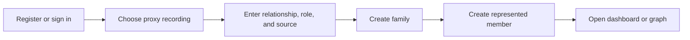
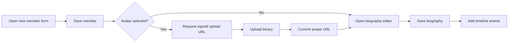
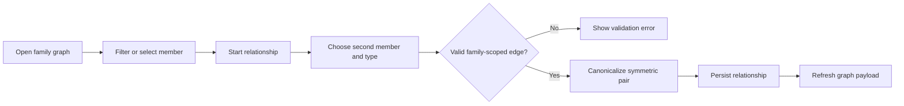

# RootLink Prototype

The V1 prototype is a desktop-first responsive application. The family graph uses React Flow with controlled node/edge state, custom member nodes, built-in navigation controls, and an inspector that connects graph interaction to editable domain records.

The page prototypes below assume a desktop-first responsive web app. This is consistent with V1’s priorities: family setup, graph editing, content entry, and proxy recording. The graph canvas is designed around React Flow’s core model of nodes and edges, a controlled graph state, and custom node components with handles. React Flow’s own docs position these primitives exactly for interactive node-based UIs. [14]

## Sitemap

```mermaid
flowchart TD
    A[/login]
    B[/register]
    C[/onboarding]
    D[/families/new]
    E[/families/:familyId]
    F[/families/:familyId/graph]
    G[/families/:familyId/members/new]
    H[/families/:familyId/members/:memberId]
    I[/families/:familyId/members/:memberId/edit]
    J[/families/:familyId/members/:memberId/biography/edit]
    K[/families/:familyId/relationships/new]
    L[/families/:familyId/settings]

    A --> C
    B --> C
    C --> D
    D --> E
    E --> F
    E --> G
    E --> H
    H --> I
    H --> J
    F --> K
    E --> L
```

## Route list

| Route | Purpose | Primary data | Primary actions |
| --- | --- | --- | --- |
| /login | Existing account entry | none | sign in |
| /register | New account entry | none | create account |
| /onboarding | First-run setup | current user state | choose self vs proxy recording |
| /families/new | Create family | user profile | create family, set slug/name |
| /families/:familyId | Family dashboard | family summary, recent timeline, member list | navigate, quick add |
| /families/:familyId/graph | Interactive graph view | members + relationships optimized for graph | inspect nodes, add relationship |
| /families/:familyId/members/new | New member form | family users, optional existing relationships | create member |
| /families/:familyId/members/:memberId | Member detail page | member, biography, timeline, relations | read, edit, upload avatar |
| /families/:familyId/members/:memberId/edit | Member edit form | member | edit identity and proxy settings |
| /families/:familyId/members/:memberId/biography/edit | Focused biography editor | biography row | save biography |
| /families/:familyId/relationships/new | Relationship form/modal route | family members | create graph edge |
| /families/:familyId/settings | Family metadata and role management | family + users | edit family settings |

## Desktop wireframes

## Family dashboard

```text
+--------------------------------------------------------------------------------------------------+
| RootLink | Tang Demo Family                                             [Add member] [View graph]|
+--------------------------------------------------------------------------------------------------+
| Family summary: 20 members | 4 generations | 50 events | last updated 2026-01-18               |
+--------------------------------------------+-----------------------------------------------------+
| Member directory                            | Recent family activity                              |
| Search [____________________]               | - Tang Yuzheng created RootLink family space        |
| Filter: generation / living / claimed       | - Tang Yuxin uploaded first branch photo archive    |
|                                            | - Tang Jianguo added military service memory note   |
| M01 Tang Wenhao                            |                                                     |
| M02 Zhao Shufang                           | Quick actions                                       |
| M03 Tang Guoqiang                          | [Add member] [Add relationship] [Invite person]     |
| ...                                        |                                                     |
+--------------------------------------------+-----------------------------------------------------+
```

## Family graph page

```text
+--------------------------------------------------------------------------------------------------+
| Tang Demo Family / Graph                                  [Add member] [Add relationship] [Fit] |
+--------------------------------------------------------------------------------------------------+
| Filters / layout                      | Graph canvas                                              |
| Generation [All v]                    | +------------------------------------------------------+  |
| Relation type [All v]                 | |                                                      |  |
| Branch [All v]                        | |                  React Flow graph                    |  |
| Auto-layout [Dagre]                   | |     nodes + edges + MiniMap + Controls + Background |  |
| [Apply] [Reset]                       | |                                                      |  |
|                                       | +------------------------------------------------------+  |
+---------------------------------------+--------------------------------------+-------------------+
| Legend / graph rules                                                       | Inspector panel    |
| Parent = directed edge                                                      | member avatar       |
| Spouse / sibling = canonical pair                                           | dates / role        |
|                                                                              | quick links         |
+------------------------------------------------------------------------------+-------------------+
```

## Member detail page

```text
+--------------------------------------------------------------------------------------------------+
| Tang Demo Family / Tang Yuzheng                                    [Edit] [Add event] [Avatar]  |
+--------------------------------------------------------------------------------------------------+
| Avatar | Name / dates / maintenance badge / source badge | Claimed by current user? [Yes]      |
+--------------------------------------------+-----------------------------------------------------+
| Biography                                  | Timeline                                            |
| Markdown viewer / editor preview           | 1999 born                                           |
|                                            | 2017 entered university                             |
|                                            | 2020 first internship                               |
|                                            | 2023 married Lin Wei                               |
|                                            | 2026 created RootLink family space                 |
+--------------------------------------------+-----------------------------------------------------+
| Relationships summary                                                                           |
| Parents: Tang Zhiguo, Li Xiulan | Spouse: Lin Wei | Child: Tang Chenxi                         |
+--------------------------------------------------------------------------------------------------+
```

## Onboarding and proxy recording

```text
+-----------------------------------------------------------------------------------------------+
| Step 1 of 4: Welcome to RootLink                                                              |
+-----------------------------------------------------------------------------------------------+
| Account created: Tang Yuzheng                                                                 |
|                                                                                               |
| Who are you recording for?                                                                    |
|   (•) Myself                                                                                  |
|   ( ) Someone else in my family                                                               |
|                                                                                               |
| If "someone else":                                                                            |
|   Relationship to them [Son/Daughter/Grandchild/Other]                                        |
|   Why are you maintaining this page? [Elder has no phone / Child / Archival / Other]          |
|   Default maintenance role [PROXY / GUARDIAN / ARCHIVIST]                                     |
|   Default source [INTERVIEW / FAMILY_MEMORY / ADMIN_CREATED]                                  |
|                                                                                               |
| [Back]                                                                  [Continue]            |
+-----------------------------------------------------------------------------------------------+
```

## Responsive behavior

On large screens, keep the graph inspector and member detail side panel visible. On tablet widths, collapse the right inspector into a drawer. On narrow mobile widths, route graph interactions through a bottom sheet and place graph toolbars into a horizontal overflow strip. V1 is still web-first, but none of the routes above depend on mobile-native patterns.

## Component hierarchy

```text
AppShell
├─ AppHeader
├─ FamilyLayout
│  ├─ FamilySummaryBar
│  ├─ MemberDirectory
│  ├─ RecentActivityFeed
│  └─ QuickActionPanel
├─ FamilyGraphPage
│  ├─ GraphToolbar
│  ├─ RelationshipGraph
│  │  ├─ ReactFlow
│  │  │  ├─ MemberNode
│  │  │  ├─ Background
│  │  │  ├─ Controls
│  │  │  └─ MiniMap
│  └─ GraphInspector
├─ MemberDetailPage
│  ├─ MemberHeaderCard
│  ├─ ProxyRecordingBanner
│  ├─ BiographyCard / BiographyEditor
│  ├─ TimelineEventList
│  └─ RelationshipSummary
├─ MemberFormPage
│  ├─ MemberForm
│  ├─ AvatarUploader
│  └─ MaintenanceRoleSelector
└─ RelationshipFormPage
   ├─ MemberSelect
   ├─ RelationshipTypeSelect
   └─ ValidationHints
```

## Key component state and props

| Component | Key props | Local state | Emits |
| --- | --- | --- | --- |
| RelationshipGraph | familyId, payload, readOnly, onMemberOpen | controlled nodes, edges, selection | onConnectIntent, onNodeClick |
| MemberNode | memberId, fullName, avatarUrl, birthYear, deathYear, maintenanceRole | hover / selected | onOpenMember, onQuickAddRelation |
| GraphInspector | selectedMember, relationships, canEdit | active tab | onEditMember, onCreateRelation |
| MemberForm | initialValue, familyId, mode | form fields, submit pending, validation errors | onSubmit, onCancel |
| AvatarUploader | memberId, currentAvatarUrl | file pending, upload progress | onUploaded |
| BiographyEditor | memberId, initialMarkdown, source, maintenanceRole, visibility | markdown text, draft dirty state | onSave |
| ProxyRecordingBanner | maintenanceRole, source, recordedByName | none | none |
| TimelineEventList | events, canEdit | sort / filter | onEditEvent, onAddEvent |

## UX flows

### Create family and begin proxy recording



### Add member, avatar, and biography



### View graph and add relationship




## React component skeletons

The React component skeletons below intentionally follow React Flow’s documented model: one main ReactFlow component, controlled graph state via useNodesState / useEdgesState, custom member nodes with <Handle />, and built-in controls for zooming and fit-view behavior. React Flow’s docs explicitly position these APIs for controlled prototyping and interactive diagrams. [15]

```tsx
// components/graph/RelationshipGraph.tsx
import React, { useCallback, useEffect, useMemo } from "react";
import {
  Background,
  Controls,
  Edge,
  MiniMap,
  Node,
  ReactFlow,
  useEdgesState,
  useNodesState,
} from "@xyflow/react";

export type MemberNodeData = {
  memberId: string;
  fullName: string;
  avatarUrl?: string | null;
  birthYear?: number | null;
  deathYear?: number | null;
  maintenanceRole: string;
  bioShort?: string | null;
};

export type GraphPayload = {
  nodes: Node<MemberNodeData>[];
  edges: Edge[];
};

type Props = {
  payload: GraphPayload;
  readOnly?: boolean;
  onMemberOpen: (memberId: string) => void;
};

export function RelationshipGraph({
  payload,
  readOnly = false,
  onMemberOpen,
}: Props) {
  const [nodes, setNodes, onNodesChange] = useNodesState<MemberNodeData>([]);
  const [edges, setEdges, onEdgesChange] = useEdgesState([]);

  useEffect(() => {
    setNodes(payload.nodes);
    setEdges(payload.edges);
  }, [payload, setNodes, setEdges]);

  const onNodeClick = useCallback(
    (_evt: React.MouseEvent, node: Node<MemberNodeData>) => {
      onMemberOpen(node.data.memberId);
    },
    [onMemberOpen]
  );

  const nodeTypes = useMemo(
    () => ({
      memberNode: MemberNode,
    }),
    []
  );

  return (
    <div style={{ width: "100%", height: "72vh" }}>
      <ReactFlow
        nodes={nodes}
        edges={edges}
        nodeTypes={nodeTypes}
        nodesDraggable={!readOnly}
        nodesConnectable={!readOnly}
        elementsSelectable={true}
        onNodesChange={onNodesChange}
        onEdgesChange={onEdgesChange}
        onNodeClick={onNodeClick}
        fitView
      >
        <MiniMap />
        <Controls />
        <Background />
      </ReactFlow>
    </div>
  );
}

// You would import this in production; kept inline here for clarity.
import { Handle, Position, NodeProps } from "@xyflow/react";

function MemberNode({ data, selected }: NodeProps<MemberNodeData>) {
  return (
    <div
      style={{
        minWidth: 180,
        padding: 12,
        borderRadius: 12,
        border: selected ? "2px solid #111827" : "1px solid #cbd5e1",
        background: "#fff",
      }}
    >
      <Handle type="target" position={Position.Top} />
      <div style={{ fontWeight: 700 }}>{data.fullName}</div>
      <div style={{ fontSize: 12, opacity: 0.75 }}>
        {data.birthYear ?? "?"} — {data.deathYear ?? ""}
      </div>
      {data.bioShort ? (
        <div style={{ marginTop: 8, fontSize: 12, opacity: 0.8 }}>
          {data.bioShort}
        </div>
      ) : null}
      <div style={{ marginTop: 8, fontSize: 11 }}>{data.maintenanceRole}</div>
      <Handle type="source" position={Position.Bottom} />
    </div>
  );
}
```

```tsx
// components/member/MemberForm.tsx
import React, { useState } from "react";

export type MemberFormValue = {
  fullName: string;
  gender?: "MALE" | "FEMALE" | "OTHER" | "UNKNOWN" | "";
  birthDate?: string;
  deathDate?: string;
  bioShort?: string;
  maintenanceRole:
    | "SELF"
    | "PROXY"
    | "GUARDIAN"
    | "FAMILY_ADMIN"
    | "ARCHIVIST";
  source:
    | "SELF_REPORTED"
    | "PROXY_RECORDED"
    | "INTERVIEW"
    | "FAMILY_MEMORY"
    | "IMPORTED"
    | "ADMIN_CREATED";
  claimedByUserId?: string | null;
};

type Props = {
  initialValue?: Partial<MemberFormValue>;
  submitLabel?: string;
  onSubmit: (value: MemberFormValue) => Promise<void>;
  onCancel?: () => void;
};

export function MemberForm({
  initialValue,
  submitLabel = "Save member",
  onSubmit,
  onCancel,
}: Props) {
  const [value, setValue] = useState<MemberFormValue>({
    fullName: initialValue?.fullName ?? "",
    gender: initialValue?.gender ?? "",
    birthDate: initialValue?.birthDate ?? "",
    deathDate: initialValue?.deathDate ?? "",
    bioShort: initialValue?.bioShort ?? "",
    maintenanceRole: initialValue?.maintenanceRole ?? "PROXY",
    source: initialValue?.source ?? "ADMIN_CREATED",
    claimedByUserId: initialValue?.claimedByUserId ?? null,
  });
  const [submitting, setSubmitting] = useState(false);

  async function handleSubmit(e: React.FormEvent) {
    e.preventDefault();
    setSubmitting(true);
    try {
      await onSubmit(value);
    } finally {
      setSubmitting(false);
    }
  }

  return (
    <form onSubmit={handleSubmit}>
      <label>
        Full name
        <input
          value={value.fullName}
          onChange={(e) => setValue({ ...value, fullName: e.target.value })}
          required
        />
      </label>

      <label>
        Gender
        <select
          value={value.gender}
          onChange={(e) =>
            setValue({ ...value, gender: e.target.value as MemberFormValue["gender"] })
          }
        >
          <option value="">Unknown</option>
          <option value="MALE">Male</option>
          <option value="FEMALE">Female</option>
          <option value="OTHER">Other</option>
          <option value="UNKNOWN">Unknown</option>
        </select>
      </label>

      <label>
        Birth date
        <input
          type="date"
          value={value.birthDate}
          onChange={(e) => setValue({ ...value, birthDate: e.target.value })}
        />
      </label>

      <label>
        Death date
        <input
          type="date"
          value={value.deathDate}
          onChange={(e) => setValue({ ...value, deathDate: e.target.value })}
        />
      </label>

      <label>
        Short bio
        <textarea
          value={value.bioShort}
          onChange={(e) => setValue({ ...value, bioShort: e.target.value })}
          rows={4}
        />
      </label>

      <label>
        Maintenance role
        <select
          value={value.maintenanceRole}
          onChange={(e) =>
            setValue({
              ...value,
              maintenanceRole: e.target.value as MemberFormValue["maintenanceRole"],
            })
          }
        >
          <option value="SELF">Self</option>
          <option value="PROXY">Proxy writer</option>
          <option value="GUARDIAN">Guardian</option>
          <option value="FAMILY_ADMIN">Family admin</option>
          <option value="ARCHIVIST">Archivist</option>
        </select>
      </label>

      <label>
        Source
        <select
          value={value.source}
          onChange={(e) =>
            setValue({ ...value, source: e.target.value as MemberFormValue["source"] })
          }
        >
          <option value="SELF_REPORTED">Self reported</option>
          <option value="PROXY_RECORDED">Proxy recorded</option>
          <option value="INTERVIEW">Interview</option>
          <option value="FAMILY_MEMORY">Family memory</option>
          <option value="IMPORTED">Imported</option>
          <option value="ADMIN_CREATED">Admin created</option>
        </select>
      </label>

      <div style={{ marginTop: 16 }}>
        <button type="submit" disabled={submitting}>
          {submitting ? "Saving..." : submitLabel}
        </button>
        {onCancel ? (
          <button type="button" onClick={onCancel} style={{ marginLeft: 8 }}>
            Cancel
          </button>
        ) : null}
      </div>
    </form>
  );
}
```

```tsx
// components/member/BiographyEditor.tsx
import React, { useState } from "react";

type Props = {
  initialMarkdown: string;
  source:
    | "SELF_REPORTED"
    | "PROXY_RECORDED"
    | "INTERVIEW"
    | "FAMILY_MEMORY"
    | "IMPORTED"
    | "ADMIN_CREATED";
  maintenanceRole:
    | "SELF"
    | "PROXY"
    | "GUARDIAN"
    | "FAMILY_ADMIN"
    | "ARCHIVIST";
  visibility: "FAMILY" | "ADMINS_ONLY" | "PRIVATE_TO_MAINTAINERS";
  onSave: (input: {
    contentMd: string;
    source: Props["source"];
    maintenanceRole: Props["maintenanceRole"];
    visibility: Props["visibility"];
  }) => Promise<void>;
};

export function BiographyEditor({
  initialMarkdown,
  source,
  maintenanceRole,
  visibility,
  onSave,
}: Props) {
  const [contentMd, setContentMd] = useState(initialMarkdown);
  const [saving, setSaving] = useState(false);

  async function handleSave() {
    setSaving(true);
    try {
      await onSave({ contentMd, source, maintenanceRole, visibility });
    } finally {
      setSaving(false);
    }
  }

  return (
    <section>
      <div style={{ marginBottom: 8, fontSize: 12, opacity: 0.8 }}>
        Source: {source} · Maintenance role: {maintenanceRole} · Visibility: {visibility}
      </div>

      <textarea
        value={contentMd}
        onChange={(e) => setContentMd(e.target.value)}
        rows={16}
        style={{ width: "100%" }}
      />

      <div style={{ marginTop: 12 }}>
        <button onClick={handleSave} disabled={saving}>
          {saving ? "Saving..." : "Save biography"}
        </button>
      </div>
    </section>
  );
}
```

```tsx
// components/onboarding/ProxyModeStep.tsx
import React from "react";

type Props = {
  value: {
    recordingMode: "SELF" | "PROXY";
    relationshipToSubject?: string;
    maintenanceRole?: "PROXY" | "GUARDIAN" | "ARCHIVIST";
    source?: "INTERVIEW" | "FAMILY_MEMORY" | "ADMIN_CREATED";
  };
  onChange: (next: Props["value"]) => void;
};

export function ProxyModeStep({ value, onChange }: Props) {
  return (
    <section>
      <h2>Who are you recording for?</h2>

      <label>
        <input
          type="radio"
          checked={value.recordingMode === "SELF"}
          onChange={() => onChange({ recordingMode: "SELF" })}
        />
        Myself
      </label>

      <label style={{ marginLeft: 12 }}>
        <input
          type="radio"
          checked={value.recordingMode === "PROXY"}
          onChange={() =>
            onChange({
              recordingMode: "PROXY",
              relationshipToSubject: value.relationshipToSubject ?? "",
              maintenanceRole: value.maintenanceRole ?? "PROXY",
              source: value.source ?? "INTERVIEW",
            })
          }
        />
        Someone else in my family
      </label>

      {value.recordingMode === "PROXY" ? (
        <div style={{ marginTop: 16 }}>
          <label>
            Relationship to the person
            <input
              value={value.relationshipToSubject ?? ""}
              onChange={(e) =>
                onChange({ ...value, relationshipToSubject: e.target.value })
              }
            />
          </label>

          <label>
            Maintenance role
            <select
              value={value.maintenanceRole}
              onChange={(e) =>
                onChange({
                  ...value,
                  maintenanceRole: e.target.value as "PROXY" | "GUARDIAN" | "ARCHIVIST",
                })
              }
            >
              <option value="PROXY">Proxy</option>
              <option value="GUARDIAN">Guardian</option>
              <option value="ARCHIVIST">Archivist</option>
            </select>
          </label>

          <label>
            Default source
            <select
              value={value.source}
              onChange={(e) =>
                onChange({
                  ...value,
                  source: e.target.value as "INTERVIEW" | "FAMILY_MEMORY" | "ADMIN_CREATED",
                })
              }
            >
              <option value="INTERVIEW">Interview</option>
              <option value="FAMILY_MEMORY">Family memory</option>
              <option value="ADMIN_CREATED">Admin created</option>
            </select>
          </label>
        </div>
      ) : null}
    </section>
  );
}
```

## References

- [Prisma relations](https://www.prisma.io/docs/orm/prisma-schema/data-model/relations)
- [Prisma many-to-many relations](https://www.prisma.io/docs/orm/prisma-schema/data-model/relations/many-to-many-relations)
- [Prisma referential actions](https://www.prisma.io/docs/orm/prisma-schema/data-model/relations/referential-actions)
- [Prisma schema reference](https://www.prisma.io/docs/orm/reference/prisma-schema-reference)
- [Prisma development and production migrations](https://www.prisma.io/docs/orm/prisma-migrate/workflows/development-and-production)
- [Prisma seeding](https://www.prisma.io/docs/orm/prisma-migrate/workflows/seeding)
- [React Flow concepts](https://reactflow.dev/learn/concepts/terms-and-definitions)
- [ReactFlow component](https://reactflow.dev/api-reference/react-flow)
- [PostgreSQL pg_dump](https://www.postgresql.org/docs/current/app-pgdump.html)
- [PostgreSQL continuous archiving and PITR](https://www.postgresql.org/docs/current/continuous-archiving.html)

[1]: https://www.prisma.io/docs/orm/prisma-schema/data-model/relations
[2]: https://reactflow.dev/learn/concepts/terms-and-definitions
[3]: https://www.prisma.io/docs/orm/prisma-migrate/workflows/development-and-production
[4]: https://www.prisma.io/docs/orm/prisma-schema/data-model/relations
[5]: https://www.prisma.io/docs/orm/reference/prisma-schema-reference
[6]: https://www.prisma.io/docs/orm/prisma-schema/data-model/relations/many-to-many-relations
[7]: https://www.prisma.io/docs/orm/prisma-schema/data-model/relations/referential-actions
[8]: https://www.prisma.io/docs/orm/prisma-migrate/workflows/seeding
[9]: https://www.prisma.io/docs/orm/prisma-schema/data-model/relations
[10]: https://www.prisma.io/docs/orm/prisma-migrate/workflows/development-and-production
[11]: https://www.prisma.io/docs/orm/reference/prisma-schema-reference
[12]: https://www.postgresql.org/docs/current/app-pgdump.html
[13]: https://www.postgresql.org/docs/current/continuous-archiving.html
[14]: https://reactflow.dev/learn/concepts/terms-and-definitions
[15]: https://reactflow.dev/api-reference/react-flow
